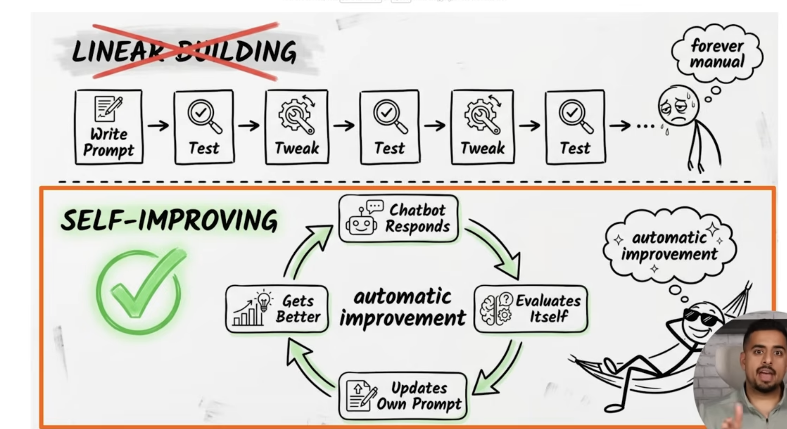
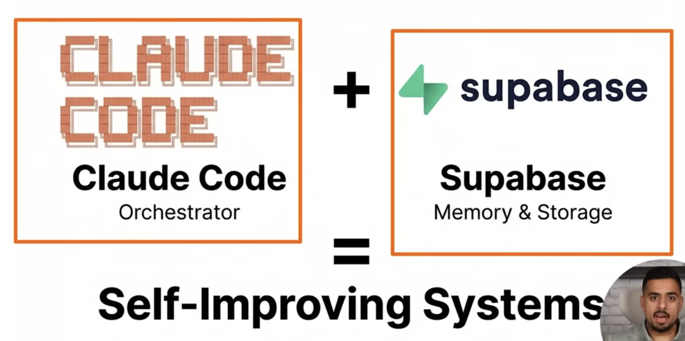
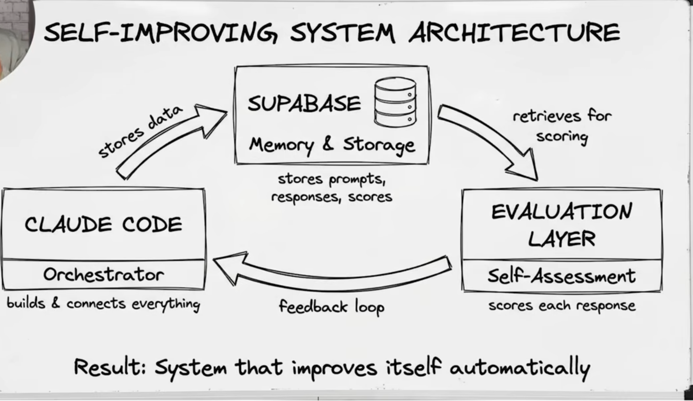

# ARIA — AI Real Estate Agent

<div align="center">

**ARIA** (Advanced Real Estate Intelligence Agent) is a full-stack AI agent that searches real estate websites **live in real-time** — the way a human agent would. Ask ARIA for properties in any city, any country, in any language. She visits top local agency websites instantly, extracts fresh listings, and brings them back to you.

> 🌐 No stale database. No cached data. 100% live web browsing + AI extraction.

[](https://fastapi.tiangolo.com)
[](https://nextjs.org)
[](https://openai.github.io/openai-agents-python/)
[](https://stagehand.dev)
[](https://supabase.com)

</div>

---

## 📸 Screenshots

| Chat Interface | Property Results | Investment Analysis |
|---|---|---|
|  |  |  |

---

## ✨ Features

| Feature | Description |
|---|---|
| 🌐 **Live Web Browsing** | Discovers agencies via Apify (primary) or Tavily (fallback), visits them with Stagehand + Playwright |
| 🏡 **Any City, Any Country** | Malta, Dubai, London, Karachi, New York — anywhere in the world |
| 🔗 **Paste Any URL** | Share any real estate website → ARIA visits it and extracts listings |
| 📈 **Investment Calculator** | ROI, gross/net yield, cap rate, monthly cashflow, payback period — pure math |
| 💱 **Currency Converter** | Convert prices to PKR, AED, USD, GBP, SAR, INR and 15+ more currencies |
| 🧠 **Cross-Session Memory** | ARIA remembers your city, budget, and preferences across sessions |
| 🤝 **Property Comparison** | Side-by-side comparison table with pros/cons and recommendation |
| 💡 **Market Intelligence** | Investment trends, rental yields, price analysis for any area |
| 📄 **PDF Export** | Export property shortlists as branded PDF reports to share |
| 🔄 **Self-Improving AI** | Scores every response on 5 dimensions, auto-corrects below threshold |
| 🌍 **Multilingual** | Urdu, English, Arabic, French — ARIA matches your language exactly |
| 💬 **Persistent Chat History** | Threads saved in Supabase — pick up where you left off |

---

## 🏗️ Architecture

```
┌─────────────────────────────────────────────────────────────────┐
│                     User (Browser)                               │
│                   Next.js 14 Chat UI                             │
└───────────────────────────┬─────────────────────────────────────┘
                            │ REST API
┌───────────────────────────▼─────────────────────────────────────┐
│                 FastAPI Backend (ARIA Agent)                      │
│                                                                   │
│  ┌─────────────────────────────────────────────────────────┐    │
│  │              OpenAI Agents SDK (v0.17)                   │    │
│  │                                                           │    │
│  │  aria_agent.py                                           │    │
│  │    ├─ Intent detection (greeting/appreciation/task)      │    │
│  │    ├─ No-location guard (asks city before anything)      │    │
│  │    ├─ Price range extraction (€200k–€500k → min/max)     │    │
│  │    ├─ Personalized context (cross-session memory)        │    │
│  │    └─ Self-improvement loop (reflect → auto-correct)     │    │
│  │                                                           │    │
│  │  ARIA's Tools (9 tools):                                 │    │
│  │    🏢 find_agencies        → Apify Google Search         │    │
│  │    🌐 live_search_properties → find + scrape pipeline    │    │
│  │    🔗 scrape_website       → Stagehand (Playwright LOCAL) │    │
│  │    🏠 get_property_details → Stagehand detail page       │    │
│  │    🔎 web_search           → Tavily / DuckDuckGo         │    │
│  │    📊 compare_properties   → GPT-4o-mini analysis        │    │
│  │    💡 market_insights      → Web search + AI synthesis   │    │
│  │    📈 investment_calculator → Pure math (no API)         │    │
│  │    💱 currency_converter   → Static rate table           │    │
│  └─────────────────────────────────────────────────────────┘    │
│                                                                   │
│  aria_reflection.py   → GPT-4o-mini quality scorer               │
│  memory/user_memory.py → Vector embeddings + user profiles        │
│  reports/generator.py  → WeasyPrint PDF export                    │
└──────┬────────────────────────┬────────────────────────────────┘
       │                        │
┌──────▼──────┐    ┌────────────▼──────────────────────────────┐
│  Supabase   │    │         Next.js API Routes                  │
│  Postgres   │    │  /api/stagehand/search  → live search      │
│  + pgvector │    │  /api/stagehand/scrape-url → scrape URL    │
│             │    │  Stagehand v3 + Playwright (LOCAL mode)    │
│  • threads  │    └────────────────────────────────────────────┘
│  • messages │
│  • user     │
│    memory   │
│  • embeddings│
└─────────────┘
```

---

## 🤖 ARIA's Self-Improvement Loop

Inspired by the M.Kashef self-improving AI architecture:

```
User Message
    ↓
ARIA responds (OpenAI Agents SDK)
    ↓
GPT-4o-mini evaluates response on 5 dimensions (0–20 each):
  1. CLARITY       — well-structured, easy to read
  2. HELPFULNESS   — moves user toward their goal
  3. COMPLETENESS  — asked for missing info when needed
  4. TOOL_USAGE    — called right tool at right moment
  5. ON_BRAND      — warm, professional, matched language
    ↓
Total score out of 100
  ≥ 55 → keep response  ✅
  < 55 → inject correction hint → re-run → better response  🔄
    ↓
Scores saved to ring buffer (last 100 turns)
    ↓
Every 20 turns: scan for recurring issues → auto-patch system prompt
```

---

## 🛠️ Tech Stack

| Layer | Technology |
|---|---|
| **Frontend** | Next.js 14 (App Router), TypeScript, Tailwind CSS |
| **Backend** | FastAPI (Python 3.11), fully async |
| **AI Agent** | OpenAI Agents SDK v0.17, GPT-4o / GPT-4o-mini |
| **Live Scraping** | Stagehand v3 + Playwright (LOCAL mode — no Browserbase needed) |
| **Agency Discovery** | Apify Google Search Scraper (PRIMARY) → Tavily fallback |
| **Web Search** | Tavily API (fallback) → DuckDuckGo fallback |
| **Database** | Supabase Postgres + pgvector (1536-dim embeddings) |
| **PDF Export** | WeasyPrint + Jinja2 |
| **Deployment** | Google Cloud Platform — e2-micro VM (forever free) |

---

## 🚀 Quick Start

### Prerequisites

- Python 3.11+
- Node.js 20+
- OpenAI API key
- Apify account (free tier — for agency discovery)
- Supabase project (free tier)
- Tavily API key (free tier — fallback web search)

### 1. Clone & install

```bash
git clone https://github.com/your-username/aria-real-estate.git
cd aria-real-estate

# Backend
cd backend
python -m venv venv
source venv/bin/activate          # Windows: venv\Scripts\activate
pip install -r requirements.txt

# Frontend
cd ../frontend
npm install
```

### 2. Configure environment variables

**`backend/.env`**
```env
# OpenAI
OPENAI_API_KEY=sk-...
OPENAI_MODEL=gpt-4o-mini          # or gpt-4o for best quality

# Supabase
DATABASE_URL=postgresql://postgres:[password]@[host]:5432/postgres
SUPABASE_URL=https://xxx.supabase.co
SUPABASE_KEY=your-anon-key

# Apify — Agency Discovery (PRIMARY)
# Get from: https://console.apify.com → Settings → API & Integrations
APIFY_API_KEY=apify_api_...

# Tavily — Web Search (FALLBACK for agency discovery + general search)
# Get from: https://tavily.com (free tier: 1000 searches/mo)
TAVILY_API_KEY=tvly-...

# Frontend URL (where Next.js Stagehand routes live)
FRONTEND_URL=http://localhost:3000

# ARIA Config
USE_ARIA_AGENT=true
ARIA_MAX_TOOL_ROUNDS=10
```

**`frontend/.env.local`**
```env
STAGEHAND_ENV=LOCAL              # Uses Playwright locally — no Browserbase needed
OPENAI_API_KEY=sk-...
NEXT_PUBLIC_API_URL=http://localhost:8000
BACKEND_PROXY_URL=http://localhost:8000
```

### 3. Set up the database

Run these SQL scripts in your Supabase SQL editor:

```sql
-- Enable vector extension
CREATE EXTENSION IF NOT EXISTS vector;

-- Chat threads
CREATE TABLE chat_threads (
  id UUID PRIMARY KEY DEFAULT gen_random_uuid(),
  title TEXT NOT NULL DEFAULT 'New Chat',
  archived BOOLEAN DEFAULT FALSE,
  created_at TIMESTAMPTZ DEFAULT NOW(),
  updated_at TIMESTAMPTZ DEFAULT NOW()
);

-- Chat messages
CREATE TABLE chat_messages (
  id UUID PRIMARY KEY DEFAULT gen_random_uuid(),
  thread_id UUID REFERENCES chat_threads(id) ON DELETE CASCADE,
  role TEXT NOT NULL CHECK (role IN ('user', 'assistant')),
  content TEXT NOT NULL,
  meta_json JSONB,
  created_at TIMESTAMPTZ DEFAULT NOW()
);

-- User memory (cross-session personalization)
CREATE TABLE user_memory (
  user_fingerprint TEXT PRIMARY KEY,
  preferred_cities TEXT[] DEFAULT '{}',
  preferred_countries TEXT[] DEFAULT '{}',
  preferred_property_types TEXT[] DEFAULT '{}',
  preferred_localities TEXT[] DEFAULT '{}',
  min_budget FLOAT,
  max_budget FLOAT,
  currency TEXT DEFAULT 'EUR',
  min_bedrooms INT,
  investment_interest BOOLEAN DEFAULT FALSE,
  rental_interest BOOLEAN DEFAULT FALSE,
  language TEXT DEFAULT 'english',
  last_city TEXT,
  last_country TEXT,
  summary TEXT,
  total_conversations INT DEFAULT 0,
  last_seen TIMESTAMPTZ DEFAULT NOW(),
  updated_at TIMESTAMPTZ DEFAULT NOW(),
  created_at TIMESTAMPTZ DEFAULT NOW()
);

-- Conversation embeddings (for RAG / memory retrieval)
CREATE TABLE conversation_embeddings (
  id UUID PRIMARY KEY DEFAULT gen_random_uuid(),
  session_id TEXT NOT NULL,
  user_fingerprint TEXT,
  role TEXT NOT NULL,
  message TEXT NOT NULL,
  embedding vector(1536),
  metadata JSONB DEFAULT '{}',
  created_at TIMESTAMPTZ DEFAULT NOW()
);

CREATE INDEX ON conversation_embeddings
  USING ivfflat (embedding vector_cosine_ops)
  WITH (lists = 100);
```

### 4. Run the servers

```bash
# Terminal 1 — FastAPI backend
cd backend
uvicorn backend.main:app --reload --port 8000

# Terminal 2 — Next.js frontend
cd frontend
npm run dev
```

Open [http://localhost:3000](http://localhost:3000) 🎉

---

## 📡 API Reference

### Chat Endpoints

| Method | Endpoint | Description |
|---|---|---|
| `GET` | `/api/chat/threads` | List all chat threads |
| `POST` | `/api/chat/threads` | Create a new thread |
| `GET` | `/api/chat/threads/{id}/messages` | Get thread messages |
| `POST` | `/api/chat/threads/{id}/messages` | Send a message to ARIA |
| `DELETE` | `/api/chat/threads/{id}` | Delete a thread |

**Send Message Request:**
```json
{
  "message": "Find me 3-bed apartments in Dubai under AED 2M",
  "user_fingerprint": "user_abc123"
}
```

**Response:**
```json
{
  "reply": "Great! 🌍 I found these top agencies in Dubai...",
  "action": "find_agencies",
  "message_meta": {
    "aria": true,
    "aria_tool_trace": [{"tool": "find_agencies", "label": "🏢 Discovering agencies..."}],
    "properties": [],
    "reflection": {"total": 82, "issues": []},
    "returning_user": true,
    "last_location": "Dubai, UAE"
  }
}
```

### Report Endpoints

| Method | Endpoint | Description |
|---|---|---|
| `POST` | `/api/reports/pdf` | Generate branded property PDF |
| `GET` | `/api/reports/pdf/health` | Check PDF engine availability |

**PDF Export Request:**
```json
{
  "property": {
    "title": "Luxury 3-Bed Apartment, Sliema",
    "price": 450000,
    "currency": "EUR",
    "bedrooms": 3,
    "bathroom_count": 2,
    "total_sqm": 145,
    "locality": "Sliema",
    "city": "Malta",
    "amenities": ["Pool", "Parking", "Sea View"]
  },
  "agency": {
    "name": "Dhalia Real Estate",
    "phone": ["+356 2138 0000"],
    "email": ["info@dhalia.com"]
  }
}
```

---

## 🧮 Investment Calculator

ARIA can calculate investment metrics for any property — no external API, pure math:

| Metric | Formula |
|---|---|
| **Gross Yield** | `(Annual rent ÷ Property price) × 100` |
| **Net Yield** | `((Annual rent − Expenses) ÷ Price) × 100` |
| **Cap Rate** | Net yield (unlevered) |
| **Monthly Cashflow** | `Rent − Mortgage payment − Monthly expenses` |
| **ROI** | `(Annual cashflow ÷ Cash deployed) × 100` |
| **Payback Period** | `Property price ÷ Net annual income` |

Investment ratings: 🟢 Excellent (≥8%) · 🟡 Good (≥6%) · 🟠 Moderate (≥4%) · 🔴 Low yield

**Example:**
> "This villa in Malta is €450,000. If I rent it for €2,500/month with €3,000 annual expenses, what's the yield?"

---

## 💱 Supported Currencies

ARIA converts between 21 currencies using indicative rates (ideal for property research):

`EUR · USD · GBP · AED · SAR · QAR · KWD · BHD · OMR · PKR · INR · BDT · TRY · EGP · MAD · CAD · AUD · SGD · MYR · JOD · LBP`

---

## 🧠 User Memory

ARIA remembers preferences across sessions using vector embeddings + PostgreSQL:

- **Welcome back greetings** — "Welcome back! Still looking in Dubai?" 😊
- **Preferred cities & types** — automatically suggests based on history
- **Budget memory** — pre-fills price filters from past searches
- **Language preference** — Urdu users always get Urdu replies
- **Investment vs. rental focus** — tailors tool calls accordingly

Memory updates every 3 messages using GPT-4o-mini extraction + pgvector similarity search.

---

## 🧪 Testing

```bash
cd backend
python -m pytest ../tests/test_aria_agent.py -v
```

**96 tests** covering intent detection, all edge cases, price range parsing, reflection engine, auto-correction, Urdu/Arabic, memory stubs, and more. All tests run without a live API key.

---

## 🚢 Deployment

### Google Cloud Platform (Free Forever)

Both frontend and backend deploy on a single **GCP e2-micro VM** (1GB RAM, forever free in us-central1).

**Why GCP e2-micro?**
- ✅ Forever free (not just 12 months)
- ✅ 1GB RAM — Playwright/Chromium runs comfortably
- ✅ Persistent server — no cold starts, no timeouts
- ✅ `STAGEHAND_ENV=LOCAL` — no Browserbase needed

```bash
# On the VM after SSH:
git clone https://github.com/DoniaBatool/Real-Estate-Scraper-Agent.git
cd Real-Estate-Scraper-Agent

# Backend
cd backend && python3 -m venv venv && source venv/bin/activate
pip install -r requirements.txt
# Create .env with your keys
pm2 start "uvicorn main:app --host 0.0.0.0 --port 8000" --name aria-backend

# Frontend
cd ../frontend && npm install
npx playwright install chromium --with-deps
npm run build
pm2 start "npm run start" --name aria-frontend
```

Access at: `http://YOUR_GCP_IP`

---

## 📁 Project Structure

```
aria-real-estate/
├── backend/
│   ├── ai/
│   │   ├── aria_agent.py          # Main agent runner + intent logic
│   │   ├── aria_agents_tools.py   # 9 ARIA tools (@function_tool)
│   │   ├── aria_prompts.py        # System prompt + tool status labels
│   │   ├── aria_reflection.py     # Self-improvement engine
│   │   └── aria_tool_runner.py    # Tool execution bridge
│   ├── memory/
│   │   └── user_memory.py         # Cross-session memory + RAG
│   ├── reports/
│   │   └── generator.py           # PDF report (WeasyPrint + Jinja2)
│   ├── routers/
│   │   ├── chat.py                # Chat API endpoints
│   │   └── reports.py             # PDF export endpoint
│   ├── main.py                    # FastAPI app
│   └── config.py                  # Settings (pydantic-settings)
├── frontend/
│   ├── app/
│   │   └── api/stagehand/         # Stagehand scraping routes
│   └── components/                # React UI components
├── tests/
│   ├── conftest.py                # Mock stubs (no API key needed)
│   └── test_aria_agent.py         # 96 tests
└── README.md
```

---

## 🗺️ Roadmap

- [ ] WhatsApp integration — send shortlist via WhatsApp
- [ ] Google Maps embed — show properties on a map
- [ ] Email alerts — notify when new listings match saved search
- [ ] Mortgage amortization calculator
- [ ] Multi-agent parallel scraping (5 agencies simultaneously)
- [ ] Mobile app (React Native)

---

## 👩‍💻 Author

Built by **Donia Batool** — Full-Stack AI Engineer

- 🌐 [LinkedIn](https://linkedin.com/in/your-profile)
- 📧 donia1510aptech@gmail.com

---

## 📄 License

MIT License — see [LICENSE](LICENSE) for details.

---

<div align="center">
  <strong>ARIA — Because your dream property deserves a real-time search. 🏡</strong>
</div>
